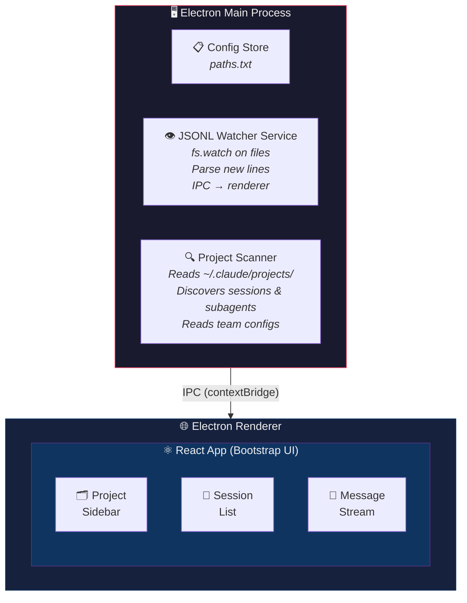
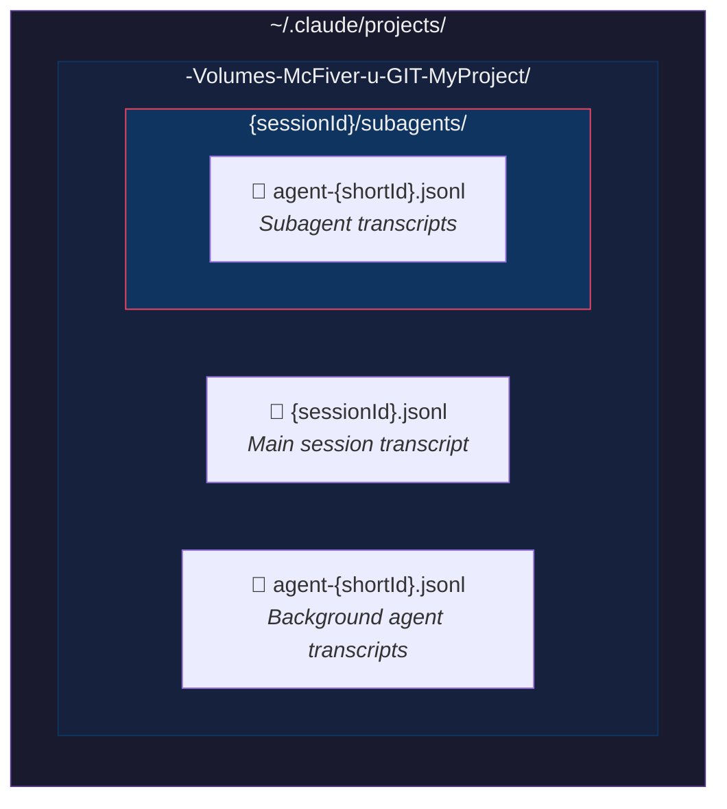
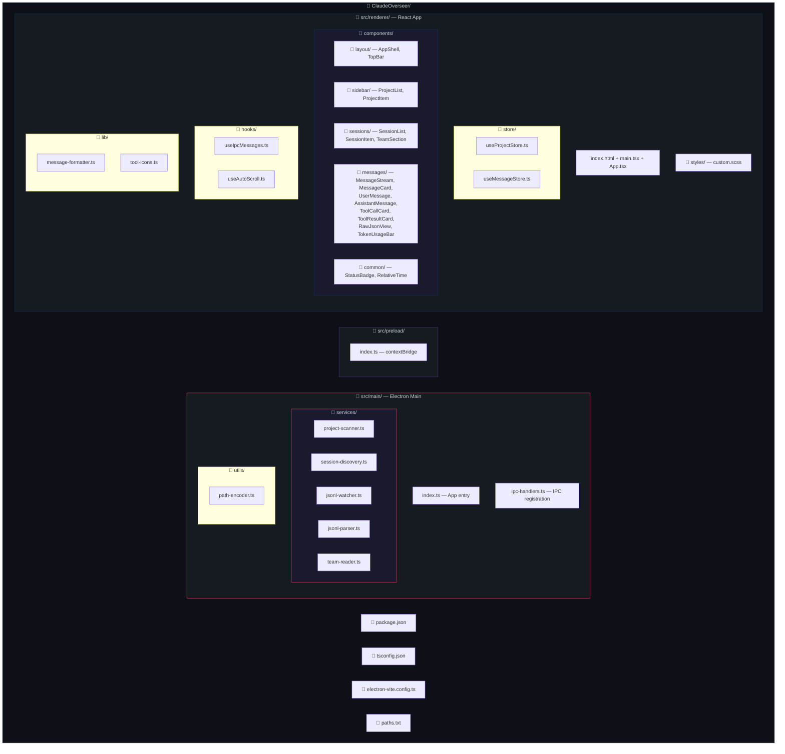
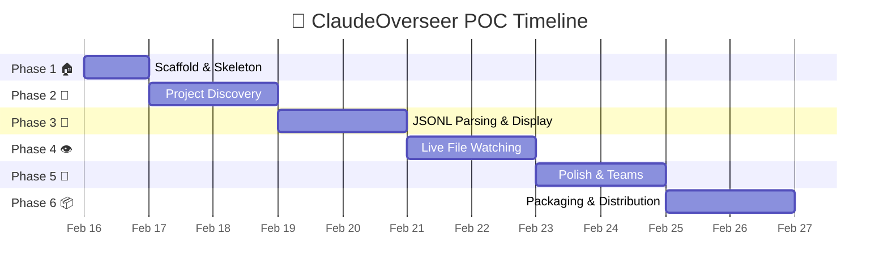
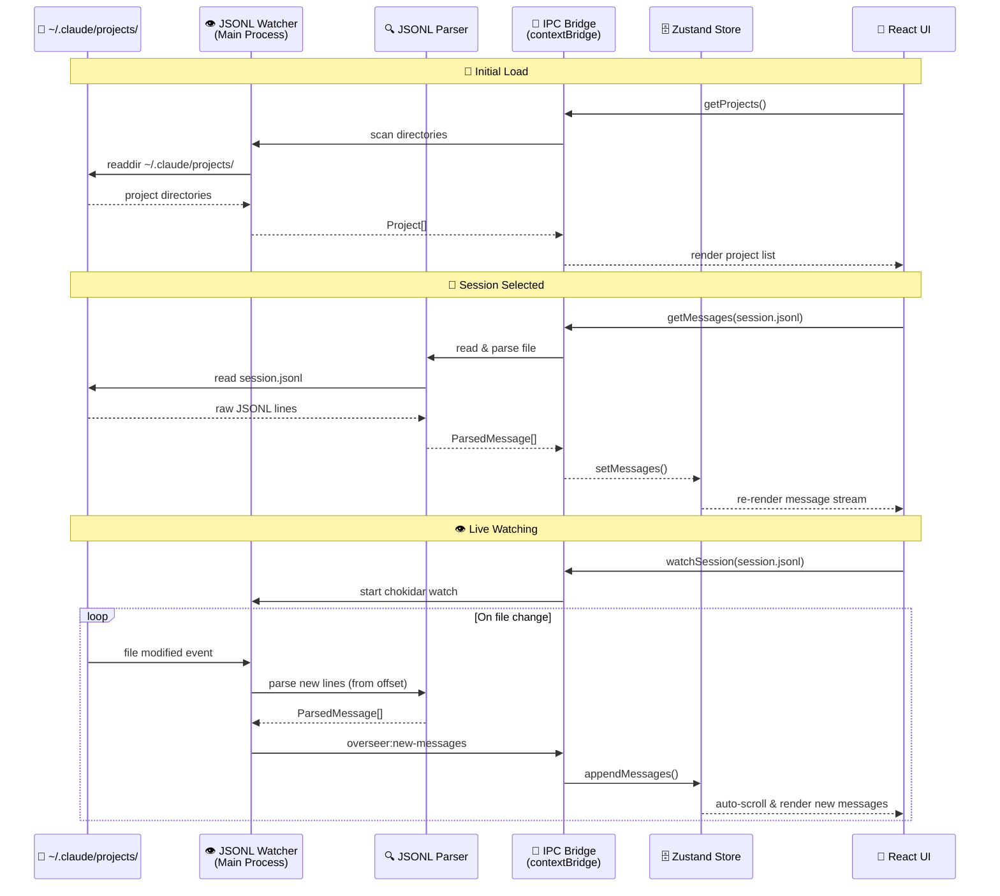
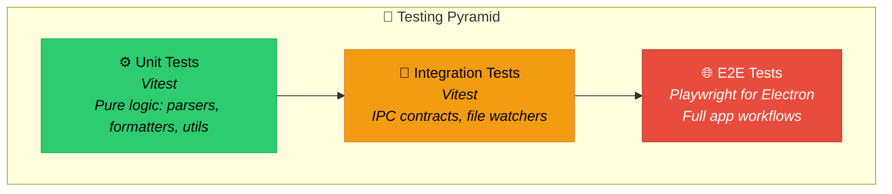
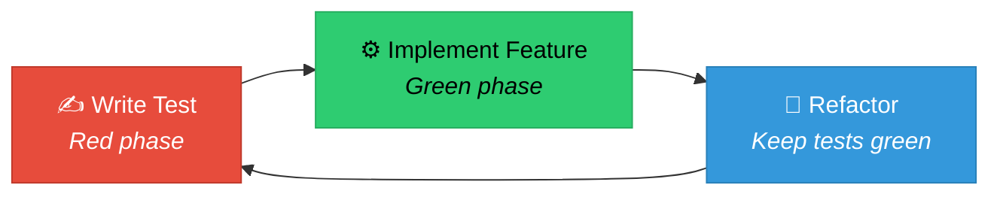

# 🔭 ClaudeOverseer - POC Implementation Plan

> **A desktop app to monitor Claude Code background agents in real-time, without spending a single extra token.**

## 📋 Overview

ClaudeOverseer is an Electron + React + TypeScript app that reads Claude Code's local JSONL log files and presents them as a live-updating, beautifully formatted chat interface — similar to the Claude web UI. It watches log files for changes via `fs.watch` and streams new messages as they arrive. Zero API calls. Zero extra cost.

### 🎯 Target Platforms
- **macOS** — primary, first-class support
- **Linux** — second priority
- **Windows** — if we can be arsed

---

## 🏗️ Architecture

### Tech Stack

| Layer | Choice | Rationale |
|-------|--------|-----------|
| **Shell** | Electron 33+ | Desktop app with filesystem access, `fs.watch` for live tailing |
| **UI Framework** | React 19 + TypeScript | Component model fits chat UIs perfectly |
| **Styling** | React-Bootstrap 2.x + Bootstrap 5 | User requested; solid widget library, good dark mode |
| **Bundler** | Vite | Fast dev, good Electron integration via `electron-vite` |
| **Markdown** | `react-markdown` + `remark-gfm` + `rehype-highlight` + `mermaid` | Render assistant messages like Claude web UI, including Mermaid diagrams |
| **State** | Zustand | Lightweight, no boilerplate, perfect for this scale |
| **File Watching** | Node.js `fs.watch` / `chokidar` | Real-time JSONL tailing in main process |

### Why Not Next.js?

Next.js is a server-centric framework (SSR, API routes, file-based routing). Inside Electron there's no server — it's all local renderer + main process. Using Next.js would add complexity (custom server setup, hydration issues, unused SSR machinery) with no benefit. **React + Vite + electron-vite** gives us everything we need: fast HMR, TypeScript, simple builds, and native Electron integration.

### Process Architecture



---

## 📁 Data Model — What We're Reading

### Source: `~/.claude/projects/`

Claude Code stores all conversation data here. The directory name is the project path with `/` replaced by `-`:



### JSONL Message Schema

Each line in a `.jsonl` file is one of these message types:

```typescript
// Queue operation (session lifecycle)
interface QueueOperation {
  type: "queue-operation";
  operation: "dequeue" | "enqueue";
  timestamp: string;           // ISO 8601
  sessionId: string;           // UUID
}

// User message (human input or tool result)
interface UserMessage {
  type: "user";
  uuid: string;
  parentUuid: string | null;
  timestamp: string;
  sessionId: string;
  cwd: string;
  version: string;             // Claude Code version
  gitBranch?: string;
  isSidechain: boolean;
  message: {
    role: "user";
    content: string | ToolResultContent[];
  };
  toolUseResult?: any;         // Parsed tool output (when present)
}

// Assistant message (Claude's response)
interface AssistantMessage {
  type: "assistant";
  uuid: string;
  parentUuid: string;
  timestamp: string;
  sessionId: string;
  cwd: string;
  version: string;
  message: {
    role: "assistant";
    model: string;             // e.g. "claude-opus-4-5-20251101"
    content: (TextBlock | ToolUseBlock)[];
    usage: {
      input_tokens: number;
      output_tokens: number;
      cache_creation_input_tokens: number;
      cache_read_input_tokens: number;
    };
    stop_reason: string | null;
  };
}

// Content block types
interface TextBlock {
  type: "text";
  text: string;
}

interface ToolUseBlock {
  type: "tool_use";
  id: string;
  name: string;                // e.g. "Bash", "Read", "Edit", "Write", "Grep"
  input: Record<string, any>;
}

interface ToolResultContent {
  type: "tool_result";
  tool_use_id: string;
  content: string;
  is_error?: boolean;
}
```

### Additional Data Sources

| Source | Path | Use |
|--------|------|-----|
| **Global history** | `~/.claude/history.jsonl` | Session index with project paths & timestamps |
| **Team configs** | `~/.claude/teams/{name}/config.json` | Team member info, models, roles |
| **Team inboxes** | `~/.claude/teams/{name}/inboxes/{agent}.json` | Inter-agent messages |
| **Tasks** | `~/.claude/tasks/{name}/{id}.json` | Task status, ownership, dependencies |
| **Debug logs** | `~/.claude/debug/{sessionId}.txt` | Low-level debug output |

---

## 🖥️ UI Design

### Layout: Three-Panel (Sidebar + List + Content)

```
┌──────────────┬─────────────────┬──────────────────────────────────┐
│ 🗂️ Projects  │  📄 Sessions    │  💬 Message Stream                │
│              │                 │                                  │
│ ▶ MyProject  │ 🟢 main session │  ┌─────────────────────────┐    │
│ ▼ ZXBasic    │ 🔵 agent-a9b5   │  │ 👤 User                  │    │
│   (3 active) │ 🔵 agent-ad8b   │  │ "Fix the login bug"     │    │
│ ▶ CldOver    │ ⚪ agent-a076   │  │              [Raw] 📋    │    │
│              │                 │  └─────────────────────────┘    │
│              │ Team: parser-p3 │                                  │
│              │  👥 team-lead    │  ┌─────────────────────────┐    │
│              │  👥 parser-impl  │  │ 🤖 Claude (opus-4-5)     │    │
│              │                 │  │                          │    │
│              │                 │  │ I'll fix the login bug.  │    │
│ ──────────── │                 │  │ Let me read the file...  │    │
│ ⚙️ Settings   │                 │  │              [Raw] 📋    │    │
│              │                 │  └─────────────────────────┘    │
│              │                 │                                  │
│              │                 │  ┌─────────────────────────┐    │
│              │                 │  │ 🔧 Tool: Read            │    │
│              │                 │  │ 📄 src/auth/login.ts     │    │
│              │                 │  │ ▶ Show output (42 lines) │    │
│              │                 │  │              [Raw] 📋    │    │
│              │                 │  └─────────────────────────┘    │
│              │                 │                                  │
│              │                 │  ┌─────────────────────────┐    │
│              │                 │  │ 🤖 Claude (opus-4-5)     │    │
│              │                 │  │ Found the issue. The...  │    │
│              │                 │  │              [Raw] 📋    │    │
│              │                 │  └─────────────────────────┘    │
│              │                 │                                  │
│              │                 │  ⏳ Streaming...               │
│              │                 │  ──────────────────────────    │
│              │                 │  📊 Tokens: 12,450 in / 890 out│
└──────────────┴─────────────────┴──────────────────────────────────┘
```

### 🎨 UI Components (React-Bootstrap)

#### Panel 1: Project Sidebar
- `ListGroup` with project names (derived from directory names)
- Badge showing active session count per project
- Expandable to show project path
- Settings gear icon at bottom

#### Panel 2: Session/Agent List
- `ListGroup` with session entries
- Status indicators (based on JSONL file mtime):

| Badge | Status | Condition |
|-------|--------|-----------|
| 🟢 | **Active** | File modified in last 60 seconds |
| 🔵 | **Recent** | File modified in last 5 minutes |
| ⚪ | **Stale** | No recent activity |
| 🔴 | **Error** | Last message was an error |
- Subagents indented under parent session
- Team section if teams exist for this project
- Sort by: most recent activity first

#### Panel 3: Message Stream (Main Content)
- Chat-style message bubbles
- **User messages**: left-aligned, distinct background
- **Assistant messages**: full-width, rendered markdown with syntax highlighting
- **Tool calls**: collapsible cards showing tool name + input
- **Tool results**: collapsible output (collapsed by default for large outputs)
- Auto-scroll to bottom (with "jump to bottom" button when scrolled up)
- Token usage summary bar at bottom

### 📨 Message Rendering

Each message gets two view modes:

1. **Formatted View** (default):
   - Markdown rendered with `react-markdown`
   - Code blocks with syntax highlighting (`rehype-highlight`)
   - **Mermaid diagrams** rendered inline (detect ` ```mermaid ` fenced blocks → render via `mermaid` library)
   - Tool calls shown as styled cards with tool icon + name
   - Tool results as collapsible panels
   - Timestamps shown as relative time ("2m ago")

2. **Raw View** (per-message toggle):
   - Pretty-printed JSON of the raw JSONL line
   - Monospace font, syntax-highlighted JSON
   - Toggle button: `[Raw]` on each message card

3. **Global Raw Toggle** (in toolbar):
   - `Switch` component in top toolbar
   - When ON, all messages show raw JSON
   - Disabled by default

### 🎭 Theme
- Dark mode by default (Bootstrap dark theme)
- Light mode toggle available
- Color-coded by agent/role for team sessions

---

## 📦 Project Structure



---

## 🔄 Implementation Phases



### Phase 1: 🏠 Scaffold & Skeleton (Day 1)
1. Initialize project: `npm create electron-vite@latest` with React + TypeScript template
2. Install dependencies: `react-bootstrap`, `bootstrap`, `zustand`, `react-markdown`, `remark-gfm`, `rehype-highlight`, `mermaid`, `chokidar`
3. Install testing dependencies: `@playwright/test`, `vitest`, `@vitest/coverage-v8`
4. Set up Vitest config: `vitest.config.ts` with coverage thresholds
5. Set up Playwright config: `playwright.config.ts` for Electron
6. Set up Bootstrap dark theme in `custom.scss`
7. Create `AppShell.tsx` — three-panel layout with placeholder content (add `data-testid` attributes)
8. Wire up basic Electron main process with window creation
9. **Test Checkpoint**:
   - Write E2E test: `tests/e2e/app-launch.spec.ts` — app launches, three panels visible
   - Run test, verify it passes
   - Run test again, verify no orphaned Electron processes (`ps aux | grep electron`)
10. Verify: app launches, shows three empty panels with Bootstrap styling

### Phase 2: 📂 Project Discovery (Day 1-2)
1. Create fixture directory: `tests/fixtures/projects/-test-project/` with sample structure
2. Implement `path-encoder.ts` — convert `/Volumes/McFiver/u/GIT/MyProject` ↔ `-Volumes-McFiver-u-GIT-MyProject`
3. **Test Checkpoint**: Write unit tests for `path-encoder.test.ts`, verify all pass
4. Implement `project-scanner.ts`:
   - Read `paths.txt` to get Claude project base dir (default: `~/.claude/projects/`)
   - List subdirectories → derive project names
   - Return `Project[]` with name, path, encoded dir name
5. **Test Checkpoint**: Write integration test `project-scanner.test.ts` using fixture dir, verify it passes
6. Implement `session-discovery.ts`:
   - For a given project dir, find all `*.jsonl` files
   - Detect parent sessions vs subagents vs background agents
   - Return `Session[]` with id, type, file path, last modified time
7. **Test Checkpoint**: Write integration test `session-discovery.test.ts` using fixture dir
8. Wire up IPC: main → renderer for project/session lists
9. **Test Checkpoint**: Write IPC contract test, verify messages flow correctly
10. Implement `ProjectList.tsx` and `SessionList.tsx` with real data (add `data-testid` attributes)
11. **Test Checkpoint**: Write E2E test `project-discovery.spec.ts` — fixture project appears in sidebar
12. Verify: app shows discovered projects and their sessions

### Phase 3: 📜 JSONL Parsing & Display (Day 2-3)
1. Create fixture JSONL: `tests/fixtures/projects/-test-project/session-123.jsonl` with sample messages
2. Implement `jsonl-parser.ts`:
   - Read full JSONL file
   - Parse each line into typed `ParsedMessage` union
   - Handle: `queue-operation`, `user`, `assistant` types
   - Extract: text content, tool calls, tool results, usage stats
3. **Test Checkpoint**: Write comprehensive unit tests for `jsonl-parser.test.ts`:
   - Valid user message → correct parse
   - Valid assistant message → correct parse
   - Malformed JSON → returns null, doesn't crash
   - Empty line → skipped gracefully
   - Mermaid code blocks in message content → preserved correctly
4. Implement `message-formatter.ts`:
   - Group consecutive assistant content blocks
   - Match tool_use → tool_result pairs by ID
   - Calculate cumulative token usage
5. **Test Checkpoint**: Write unit tests for `message-formatter.test.ts`, verify grouping logic
6. Build message components (all with `data-testid` attributes):
   - `UserMessage.tsx` — simple text display with avatar
   - `AssistantMessage.tsx` — markdown rendering with model badge, Mermaid support
   - `ToolCallCard.tsx` — collapsible card: tool name, icon, input params
   - `ToolResultCard.tsx` — collapsible output (collapsed >10 lines)
   - `RawJsonView.tsx` — toggle-able JSON pretty-print per message
7. Build `MessageStream.tsx` — virtualized scrollable list
8. Implement raw toggle: per-message `[Raw]` button + global switch
9. **Test Checkpoint**: Write E2E test `message-stream.spec.ts`:
   - Open fixture session → messages render correctly
   - Click raw toggle → JSON appears
   - Mermaid diagrams render (check for presence of `<svg>` elements)
10. Verify: can open a session and see formatted conversation

### Phase 4: 👁️ Live Watching (Day 3-4)
1. Implement `jsonl-watcher.ts`:
   - Use `chokidar` to watch active JSONL file
   - Track file offset (bytes read so far)
   - On change: read new bytes, split into lines, parse, emit via IPC
   - Handle file rotation/truncation gracefully
2. **Test Checkpoint**: Write integration test `jsonl-watcher.test.ts`:
   - Create temp file, start watching
   - Append new JSONL line → verify event fires with correct parsed message
   - Append multiple lines rapidly → all captured
   - Stop watching, append line → no event (cleanup verified)
3. Wire up IPC event: `overseer:new-messages` → renderer
4. Implement `useIpcMessages.ts` hook:
   - Subscribe to IPC channel
   - Append new messages to store
5. Implement `useAutoScroll.ts`:
   - Auto-scroll when user is at bottom
   - Show "⬇️ New messages" button when scrolled up
6. Add session status detection:
   - Watch `mtime` of JSONL files
   - Update 🟢🔵⚪ badges in session list
7. **Test Checkpoint**: Write E2E test `live-watching.spec.ts`:
   - Open fixture session
   - Use Node.js `fs.appendFileSync` to add JSONL line to watched file
   - Wait for new message to appear in UI (with timeout)
   - Verify auto-scroll happened
   - Verify status badge changed to 🟢 (active)
8. Verify: can watch a live session and see messages appear in real-time

### Phase 5: 🧹 Polish & Teams (Day 4-5)
1. Create fixture team data: `tests/fixtures/teams/test-team/config.json` with sample members
2. Add team support:
   - `team-reader.ts` — parse team configs, task lists, inboxes
   - `TeamSection.tsx` — show team members with roles/models
   - Task status display (pending/in-progress/completed)
3. **Test Checkpoint**: Write unit tests for `team-reader.test.ts`, verify parsing
4. Token usage summary bar at bottom of message stream
5. Keyboard shortcuts:
   - `Cmd+1/2/3` — focus panels
   - `Cmd+R` — refresh project list
   - `Cmd+J` — toggle raw mode
6. **Test Checkpoint**: Write E2E test for keyboard shortcuts (Playwright `keyboard.press()`)
7. Error handling & edge cases:
   - Missing/corrupt JSONL lines (skip gracefully)
   - Very large files (read last N messages initially, load more on scroll up)
   - Sessions with no messages yet
8. **Test Checkpoint**: Write unit tests for edge cases (corrupt JSON, empty files, etc.)
9. App icon & title bar customization
10. Basic "About" dialog
11. **Test Checkpoint**: Run full E2E suite, verify all tests pass with no orphaned processes

### Phase 6: 📦 Packaging (Day 5+)
1. Configure `electron-builder` for macOS `.dmg`
2. Code-sign for macOS (if distributing)
3. Add Linux `.AppImage` / `.deb` build targets
4. Set up CI/CD: `.github/workflows/test.yml` — run full test suite on push/PR
5. Set up CI/CD: `.github/workflows/release.yml` — build DMG on tag push
6. **Test Checkpoint**: Verify CI runs successfully:
   - All unit tests pass
   - All integration tests pass
   - All E2E tests pass
   - No orphaned processes after E2E suite
   - Coverage meets thresholds (aim for >80% on core logic)
7. Create README with screenshots (take screenshots manually, NOT programmatically)
8. GitHub releases workflow

---

## 🔄 Data Flow



---

## 🧪 Testing Strategy

> **CRITICAL**: The app under test must NEVER be modified for testing purposes. Use external tooling only.

### Testing Principles

1. **Separation of Concerns** — Test code lives in `tests/`, app code in `src/`. Never mix them.
2. **No Self-Modification** — The running app NEVER modifies itself, takes screenshots of itself, or injects test code at runtime.
3. **Use Platform Tools** — macOS Accessibility APIs, Electron DevTools, and standard testing frameworks only.
4. **Reproducible Environments** — Tests run against fixture JSONL files, not live `~/.claude/` data.
5. **Fast Feedback Loop** — Unit tests run in <5s, integration tests in <30s.

### Testing Layers



### Test Structure

```
tests/
├── unit/                           # Fast, isolated tests (Vitest)
│   ├── main/
│   │   ├── path-encoder.test.ts    # Path encoding logic
│   │   ├── jsonl-parser.test.ts    # JSONL parsing with fixture data
│   │   └── message-formatter.test.ts
│   └── renderer/
│       ├── message-formatter.test.ts
│       └── tool-icons.test.ts
│
├── integration/                    # IPC & file system tests (Vitest)
│   ├── project-scanner.test.ts     # Scan fixture directories
│   ├── jsonl-watcher.test.ts       # Watch test files, verify events
│   └── ipc-contract.test.ts        # Main ↔ Renderer communication
│
├── e2e/                            # End-to-end (Playwright)
│   ├── app-launch.spec.ts          # App starts, shows three panels
│   ├── project-discovery.spec.ts   # Load projects from fixture data
│   ├── message-stream.spec.ts      # Open session, render messages
│   └── live-watching.spec.ts       # Tail a file, new messages appear
│
└── fixtures/                       # Test data (NEVER use real ~/.claude/)
    ├── projects/
    │   └── -test-project/
    │       └── session-123.jsonl   # Sample JSONL files
    └── expected/
        └── parsed-messages.json    # Expected parser output
```

### 1. Unit Tests (Vitest)

**What**: Pure functions with no side effects (parsers, formatters, path encoding).

**How**: Standard Vitest tests with fixtures.

```typescript
// tests/unit/main/jsonl-parser.test.ts
import { describe, it, expect } from 'vitest';
import { parseJsonlLine } from '@/main/services/jsonl-parser';

describe('JSONL Parser', () => {
  it('parses user message', () => {
    const line = '{"type":"user","uuid":"abc","message":{"role":"user","content":"hello"}}';
    const parsed = parseJsonlLine(line);
    expect(parsed.type).toBe('user');
    expect(parsed.message.content).toBe('hello');
  });

  it('handles malformed JSON gracefully', () => {
    const line = '{invalid json}';
    const parsed = parseJsonlLine(line);
    expect(parsed).toBeNull(); // Don't crash, return null
  });
});
```

**Run**: `npm run test:unit` (runs in ~5s)

### 2. Integration Tests (Vitest + Node.js)

**What**: IPC contracts, file watchers, project scanning with fixture data.

**How**: Mock filesystem with `memfs` or use fixture directories in `tests/fixtures/`.

```typescript
// tests/integration/project-scanner.test.ts
import { describe, it, expect } from 'vitest';
import { scanProjects } from '@/main/services/project-scanner';
import path from 'path';

describe('Project Scanner', () => {
  it('discovers projects from fixture directory', async () => {
    const fixtureDir = path.join(__dirname, '../fixtures/projects');
    const projects = await scanProjects(fixtureDir);

    expect(projects).toHaveLength(1);
    expect(projects[0].name).toBe('test-project');
  });
});
```

**Run**: `npm run test:integration` (runs in ~30s)

### 3. E2E Tests (Playwright for Electron)

**What**: Full application workflows from user perspective.

**How**: Use `@playwright/test` with Electron support. Launch app, interact via accessibility APIs, assert UI state.

**Setup**:
```typescript
// tests/e2e/app-launch.spec.ts
import { test, expect, _electron as electron } from '@playwright/test';
import path from 'path';

test('app launches and shows three panels', async () => {
  const app = await electron.launch({
    args: [path.join(__dirname, '../../dist-electron/main.js')],
    env: {
      ...process.env,
      CLAUDE_PROJECTS_DIR: path.join(__dirname, '../fixtures/projects'),
    }
  });

  const window = await app.firstWindow();

  // Assert three panels exist
  const projectSidebar = await window.locator('[data-testid="project-sidebar"]');
  const sessionList = await window.locator('[data-testid="session-list"]');
  const messageStream = await window.locator('[data-testid="message-stream"]');

  await expect(projectSidebar).toBeVisible();
  await expect(sessionList).toBeVisible();
  await expect(messageStream).toBeVisible();

  await app.close();
});
```

**Critical**: Use `data-testid` attributes in components for stable selectors. Never rely on text content or CSS classes.

**Critical Cleanup**: Always close the app in a `finally` block to prevent Electron process leaks:

```typescript
test('example test', async () => {
  let app;
  try {
    app = await electron.launch({ /* ... */ });
    // ... test code ...
  } finally {
    if (app) {
      await app.close(); // ALWAYS close, even on test failure
    }
  }
});
```

**Better Pattern**: Use Playwright's `test.beforeEach` / `test.afterEach`:

```typescript
// tests/e2e/helpers/electron-app.ts
import { test as base, _electron as electron } from '@playwright/test';

export const test = base.extend({
  app: async ({}, use) => {
    const app = await electron.launch({
      args: [path.join(__dirname, '../../dist-electron/main.js')],
    });
    await use(app);
    await app.close(); // Auto-cleanup after each test
  },
});
```

**Verify Cleanup**: After running E2E tests, confirm no orphaned processes:

```bash
npm run test:e2e
ps aux | grep -i electron  # Should return NO results (except grep itself)
```

If Electron processes remain, the tests are not cleaning up properly. Fix before proceeding.

**Run**: `npm run test:e2e` (runs in ~2min)

### 4. Development Tools (NOT Testing Code)

These are for **manual inspection during development**, not automated tests.

#### Electron DevTools (Built-in)

Enable Chrome DevTools for the renderer process:

```typescript
// src/main/index.ts
const mainWindow = new BrowserWindow({
  webPreferences: {
    devTools: true, // Enable in dev mode
  }
});

if (process.env.NODE_ENV === 'development') {
  mainWindow.webContents.openDevTools({ mode: 'detach' });
}
```

**Usage**:
- Inspect React component tree with React DevTools extension
- Debug IPC messages in Console
- Profile performance with Performance tab
- Network tab for resource loading (not applicable here, but useful for web content)

#### Remote Debugging Protocol

Enable remote debugging on a port:

```typescript
// src/main/index.ts
app.commandLine.appendSwitch('remote-debugging-port', '9222');
```

Connect from Chrome: `chrome://inspect` → Configure `localhost:9222` → Inspect target.

**Use case**: Debug renderer process from external browser without modifying app.

#### macOS Accessibility Inspector

**Built-in tool**: `/System/Library/CoreServices/Applications/Accessibility Inspector.app`

**Usage**:
1. Launch ClaudeOverseer
2. Open Accessibility Inspector
3. Hover over UI elements to see their accessibility tree
4. Verify `data-testid` attributes are exposed via `AXIdentifier`

**Use case**: Verify UI is accessible and testable via Playwright selectors.

### 5. CI/CD Testing

```yaml
# .github/workflows/test.yml
name: Test

on: [push, pull_request]

jobs:
  test:
    runs-on: macos-latest # Must use macOS for Electron

    steps:
      - uses: actions/checkout@v4
      - uses: actions/setup-node@v4
        with:
          node-version: '20'

      - name: Install dependencies
        run: npm ci

      - name: Run unit tests
        run: npm run test:unit

      - name: Run integration tests
        run: npm run test:integration

      - name: Build app
        run: npm run build

      - name: Run E2E tests
        run: npm run test:e2e

      - name: Upload test results
        if: always()
        uses: actions/upload-artifact@v4
        with:
          name: test-results
          path: test-results/
```

### Test Commands

Add to `package.json`:

```json
{
  "scripts": {
    "test": "npm run test:unit && npm run test:integration",
    "test:unit": "vitest run tests/unit",
    "test:integration": "vitest run tests/integration",
    "test:e2e": "playwright test tests/e2e",
    "test:watch": "vitest watch tests/unit",
    "test:coverage": "vitest run --coverage"
  }
}
```

### What NOT To Do ⛔

1. **❌ NO Screenshots** — Never use screenshot comparison testing. It's brittle, slow, and non-deterministic.
2. **❌ NO Self-Modification** — The app under test must never inject test code, mock its own modules at runtime, or modify its behavior based on env vars beyond fixture paths.
3. **❌ NO Puppeteer for Electron** — Use Playwright's native Electron support instead.
4. **❌ NO Testing Against Real Data** — Never run tests against `~/.claude/`. Use fixtures only.
5. **❌ NO Mocking in E2E** — E2E tests should exercise the real app. Only mock external APIs (none in this app).

### Test-Driven Development Workflow



For each feature:
1. Write failing unit test
2. Implement minimal code to pass
3. Add integration test if touching IPC/filesystem
4. Add E2E test if user-facing
5. Refactor with tests as safety net

### Testing Milestones Per Phase

- **Phase 1**: Basic app launch E2E test
- **Phase 2**: Project scanner unit + integration tests
- **Phase 3**: JSONL parser unit tests, message formatter tests
- **Phase 4**: File watcher integration tests, live streaming E2E test
- **Phase 5**: Full E2E suite covering all workflows

---

## 🔌 IPC API Contract

```typescript
// Main → Renderer channels
interface OverseerAPI {
  // Project discovery
  getProjects(): Promise<Project[]>;
  getSessions(projectDir: string): Promise<Session[]>;

  // Message loading
  getMessages(sessionFilePath: string): Promise<ParsedMessage[]>;

  // Live watching
  watchSession(sessionFilePath: string): void;
  unwatchSession(sessionFilePath: string): void;
  onNewMessages(callback: (messages: ParsedMessage[]) => void): () => void;

  // Team data
  getTeamConfig(teamName: string): Promise<TeamConfig | null>;
  getTeamTasks(teamName: string): Promise<Task[]>;

  // Session status
  onSessionStatusChanged(callback: (statuses: SessionStatus[]) => void): () => void;
}

// Exposed via contextBridge as `window.overseer`
```

---

## ⛔ Development Anti-Patterns to AVOID

> **These practices led to catastrophic failures in previous attempts. DO NOT REPEAT.**

### ❌ Screenshot-Based Testing

**NEVER**:
- Take screenshots programmatically for comparison testing
- Use image diffing tools (Applitools, Percy, etc.)
- Save screenshots to verify UI state

**Why**: Flaky, slow, non-deterministic. Fonts render differently across machines. Impossible to debug failures.

**Instead**: Use Playwright selectors with `data-testid` attributes to verify DOM structure.

### ❌ Self-Modifying Application Code

**NEVER**:
- Add test-only code paths to production code (`if (process.env.TEST_MODE)`)
- Inject mocks or stubs at runtime based on env vars
- Modify the app to "test itself" (e.g., app takes screenshots of its own UI)
- Change behavior based on whether DevTools is open

**Why**: Production code should never know it's being tested. Tests should exercise real app behavior.

**Instead**: Use Playwright to control the app externally. Use fixtures for data instead of mocking.

### ❌ Ignoring Native Platform Tools

**NEVER**:
- Reinvent accessibility APIs (macOS provides these natively)
- Build custom remote debugging (Electron has this built-in)
- Create custom test runners when Playwright exists

**Why**: Native tools are battle-tested, maintained, and integrated with the platform.

**Instead**: Use macOS Accessibility Inspector, Electron DevTools remote debugging, and Playwright.

### ❌ Resource Leaks

**NEVER**:
- Launch Electron without guaranteeing `app.close()` in a `finally` block
- Skip cleanup on test failure ("it'll clean up eventually")
- Ignore orphaned processes (`ps aux | grep electron` should be empty after tests)

**Why**: Hundreds of Electron processes will consume all RAM and crash your machine.

**Instead**: Use Playwright's fixture pattern or try/finally blocks. Verify cleanup with `ps aux`.

### ❌ Testing Against Live Data

**NEVER**:
- Run tests against real `~/.claude/` directories
- Modify user's actual JSONL files during testing
- Assume `~/.claude/` exists or has specific structure

**Why**: Destructive, non-reproducible, violates user privacy.

**Instead**: Use `tests/fixtures/` with controlled test data. Set `CLAUDE_PROJECTS_DIR` env var to fixture path.

---

## ⚡ Key Design Decisions

1. **Read-only** — We never write to Claude's files. Zero risk of corrupting sessions.
2. **No API calls** — Everything is local file I/O. No tokens consumed. No auth needed.
3. **Streaming simulation** — New JSONL lines appear as they're written, creating a "live stream" effect identical to watching Claude work in real-time.
4. **Graceful degradation** — Malformed JSONL lines are skipped with a warning, never crash the app.
5. **Lazy loading** — Large sessions load the last 200 messages initially, with "load more" on scroll up.
6. **No Next.js** — React + Vite is the right fit for Electron. No server-side rendering overhead.

---

## 📎 Dependencies (Initial)

```json
{
  "dependencies": {
    "react": "^19.0.0",
    "react-dom": "^19.0.0",
    "react-bootstrap": "^2.10.0",
    "bootstrap": "^5.3.3",
    "zustand": "^5.0.0",
    "react-markdown": "^9.0.0",
    "remark-gfm": "^4.0.0",
    "rehype-highlight": "^7.0.0",
    "mermaid": "^11.0.0",
    "chokidar": "^4.0.0"
  },
  "devDependencies": {
    "electron": "^33.0.0",
    "electron-vite": "^3.0.0",
    "electron-builder": "^25.0.0",
    "typescript": "^5.7.0",
    "sass": "^1.80.0",
    "@types/react": "^19.0.0",
    "@types/react-dom": "^19.0.0",
    "@playwright/test": "^1.48.0",
    "vitest": "^2.1.0",
    "@vitest/coverage-v8": "^2.1.0"
  }
}
```

---

## 🚀 Getting Started (After Plan Approval)

```bash
cd ClaudeOverseer
npm create electron-vite@latest . -- --template react-ts
npm install react-bootstrap bootstrap zustand react-markdown remark-gfm rehype-highlight mermaid chokidar
npm install -D sass
npm run dev   # Launch in dev mode with HMR
```

---

## 🔮 Future Ideas (Not POC Scope)
- 🔍 Search across all sessions (full-text search on JSONL content)
- 📊 Dashboard view — all active agents at a glance with progress bars
- 🔔 Desktop notifications when agents finish or error
- 📈 Token usage analytics over time
- 🎨 Customizable themes beyond light/dark
- 🔗 Click-to-open files referenced in tool calls (open in VS Code)
- 🏷️ Tag/bookmark important messages
- 📤 Export conversation as markdown/HTML
- 🌐 Optional web UI mode (serve over local HTTP for remote monitoring)
