# 🔭 ClaudeOverseer - POC Implementation Plan

> **A desktop app to monitor Claude Code background agents in real-time, without spending a single extra token.**

## 📋 Overview

ClaudeOverseer is an Electron + React + TypeScript app that reads Claude Code's local JSONL log files and presents them as a live-updating, beautifully formatted chat interface — similar to the Claude web UI. It watches log files for changes via `fs.watch` and streams new messages as they arrive. Zero API calls. Zero extra cost.

### 🎯 Target Platforms
- **macOS** — primary, first-class support
- **Linux** — second priority
- **Windows** — if we can be arsed

---

## 🏗️ Architecture

### Tech Stack

| Layer | Choice | Rationale |
|-------|--------|-----------|
| **Shell** | Electron 33+ | Desktop app with filesystem access, `fs.watch` for live tailing |
| **UI Framework** | React 19 + TypeScript | Component model fits chat UIs perfectly |
| **Styling** | React-Bootstrap 2.x + Bootstrap 5 | User requested; solid widget library, good dark mode |
| **Bundler** | Vite | Fast dev, good Electron integration via `electron-vite` |
| **Markdown** | `react-markdown` + `remark-gfm` + `rehype-highlight` + `mermaid` | Render assistant messages like Claude web UI, including Mermaid diagrams |
| **State** | Zustand | Lightweight, no boilerplate, perfect for this scale |
| **File Watching** | Node.js `fs.watch` / `chokidar` | Real-time JSONL tailing in main process |

### Why Not Next.js?

Next.js is a server-centric framework (SSR, API routes, file-based routing). Inside Electron there's no server — it's all local renderer + main process. Using Next.js would add complexity (custom server setup, hydration issues, unused SSR machinery) with no benefit. **React + Vite + electron-vite** gives us everything we need: fast HMR, TypeScript, simple builds, and native Electron integration.

### Process Architecture

```mermaid
graph TB
    subgraph Main["🖥️ Electron Main Process"]
        Config["📋 Config Store<br/><i>paths.txt</i>"]
        Watcher["👁️ JSONL Watcher Service<br/><i>fs.watch on files</i><br/><i>Parse new lines</i><br/><i>IPC → renderer</i>"]
        Scanner["🔍 Project Scanner<br/><i>Reads ~/.claude/projects/</i><br/><i>Discovers sessions & subagents</i><br/><i>Reads team configs</i>"]
    end

    Main -->|"IPC (contextBridge)"| Renderer

    subgraph Renderer["🌐 Electron Renderer"]
        subgraph ReactApp["⚛️ React App (Bootstrap UI)"]
            Sidebar["🗂️ Project<br/>Sidebar"]
            Sessions["📄 Session<br/>List"]
            Stream["💬 Message<br/>Stream"]
        end
    end

    style Main fill:#1a1a2e,stroke:#e94560,color:#eee
    style Renderer fill:#16213e,stroke:#0f3460,color:#eee
    style ReactApp fill:#0f3460,stroke:#533483,color:#eee
```



---

## 📁 Data Model — What We're Reading

### Source: `~/.claude/projects/`

Claude Code stores all conversation data here. The directory name is the project path with `/` replaced by `-`:

```mermaid
graph LR
    subgraph ClaudeDir["~/.claude/projects/"]
        subgraph Project["-Volumes-McFiver-u-GIT-MyProject/"]
            MainSession["📄 {sessionId}.jsonl<br/><i>Main session transcript</i>"]
            subgraph SubDir["{sessionId}/subagents/"]
                SubAgent["📄 agent-{shortId}.jsonl<br/><i>Subagent transcripts</i>"]
            end
            BgAgent["📄 agent-{shortId}.jsonl<br/><i>Background agent transcripts</i>"]
        end
    end

    style ClaudeDir fill:#1a1a2e,stroke:#533483,color:#eee
    style Project fill:#16213e,stroke:#0f3460,color:#eee
    style SubDir fill:#0f3460,stroke:#e94560,color:#eee
```



### JSONL Message Schema

Each line in a `.jsonl` file is one of these message types:

```typescript
// Queue operation (session lifecycle)
interface QueueOperation {
  type: "queue-operation";
  operation: "dequeue" | "enqueue";
  timestamp: string;           // ISO 8601
  sessionId: string;           // UUID
}

// User message (human input or tool result)
interface UserMessage {
  type: "user";
  uuid: string;
  parentUuid: string | null;
  timestamp: string;
  sessionId: string;
  cwd: string;
  version: string;             // Claude Code version
  gitBranch?: string;
  isSidechain: boolean;
  message: {
    role: "user";
    content: string | ToolResultContent[];
  };
  toolUseResult?: any;         // Parsed tool output (when present)
}

// Assistant message (Claude's response)
interface AssistantMessage {
  type: "assistant";
  uuid: string;
  parentUuid: string;
  timestamp: string;
  sessionId: string;
  cwd: string;
  version: string;
  message: {
    role: "assistant";
    model: string;             // e.g. "claude-opus-4-5-20251101"
    content: (TextBlock | ToolUseBlock)[];
    usage: {
      input_tokens: number;
      output_tokens: number;
      cache_creation_input_tokens: number;
      cache_read_input_tokens: number;
    };
    stop_reason: string | null;
  };
}

// Content block types
interface TextBlock {
  type: "text";
  text: string;
}

interface ToolUseBlock {
  type: "tool_use";
  id: string;
  name: string;                // e.g. "Bash", "Read", "Edit", "Write", "Grep"
  input: Record<string, any>;
}

interface ToolResultContent {
  type: "tool_result";
  tool_use_id: string;
  content: string;
  is_error?: boolean;
}
```

### Additional Data Sources

| Source | Path | Use |
|--------|------|-----|
| **Global history** | `~/.claude/history.jsonl` | Session index with project paths & timestamps |
| **Team configs** | `~/.claude/teams/{name}/config.json` | Team member info, models, roles |
| **Team inboxes** | `~/.claude/teams/{name}/inboxes/{agent}.json` | Inter-agent messages |
| **Tasks** | `~/.claude/tasks/{name}/{id}.json` | Task status, ownership, dependencies |
| **Debug logs** | `~/.claude/debug/{sessionId}.txt` | Low-level debug output |

---

## 🖥️ UI Design

### Layout: Three-Panel (Sidebar + List + Content)

```
┌──────────────┬─────────────────┬──────────────────────────────────┐
│ 🗂️ Projects  │  📄 Sessions    │  💬 Message Stream                │
│              │                 │                                  │
│ ▶ MyProject  │ 🟢 main session │  ┌─────────────────────────┐    │
│ ▼ ZXBasic    │ 🔵 agent-a9b5   │  │ 👤 User                  │    │
│   (3 active) │ 🔵 agent-ad8b   │  │ "Fix the login bug"     │    │
│ ▶ CldOver    │ ⚪ agent-a076   │  │              [Raw] 📋    │    │
│              │                 │  └─────────────────────────┘    │
│              │ Team: parser-p3 │                                  │
│              │  👥 team-lead    │  ┌─────────────────────────┐    │
│              │  👥 parser-impl  │  │ 🤖 Claude (opus-4-5)     │    │
│              │                 │  │                          │    │
│              │                 │  │ I'll fix the login bug.  │    │
│ ──────────── │                 │  │ Let me read the file...  │    │
│ ⚙️ Settings   │                 │  │              [Raw] 📋    │    │
│              │                 │  └─────────────────────────┘    │
│              │                 │                                  │
│              │                 │  ┌─────────────────────────┐    │
│              │                 │  │ 🔧 Tool: Read            │    │
│              │                 │  │ 📄 src/auth/login.ts     │    │
│              │                 │  │ ▶ Show output (42 lines) │    │
│              │                 │  │              [Raw] 📋    │    │
│              │                 │  └─────────────────────────┘    │
│              │                 │                                  │
│              │                 │  ┌─────────────────────────┐    │
│              │                 │  │ 🤖 Claude (opus-4-5)     │    │
│              │                 │  │ Found the issue. The...  │    │
│              │                 │  │              [Raw] 📋    │    │
│              │                 │  └─────────────────────────┘    │
│              │                 │                                  │
│              │                 │  ⏳ Streaming...               │
│              │                 │  ──────────────────────────    │
│              │                 │  📊 Tokens: 12,450 in / 890 out│
└──────────────┴─────────────────┴──────────────────────────────────┘
```

### 🎨 UI Components (React-Bootstrap)

#### Panel 1: Project Sidebar
- `ListGroup` with project names (derived from directory names)
- Badge showing active session count per project
- Expandable to show project path
- Settings gear icon at bottom

#### Panel 2: Session/Agent List
- `ListGroup` with session entries
- Status indicators (based on JSONL file mtime):

| Badge | Status | Condition |
|-------|--------|-----------|
| 🟢 | **Active** | File modified in last 60 seconds |
| 🔵 | **Recent** | File modified in last 5 minutes |
| ⚪ | **Stale** | No recent activity |
| 🔴 | **Error** | Last message was an error |
- Subagents indented under parent session
- Team section if teams exist for this project
- Sort by: most recent activity first

#### Panel 3: Message Stream (Main Content)
- Chat-style message bubbles
- **User messages**: left-aligned, distinct background
- **Assistant messages**: full-width, rendered markdown with syntax highlighting
- **Tool calls**: collapsible cards showing tool name + input
- **Tool results**: collapsible output (collapsed by default for large outputs)
- Auto-scroll to bottom (with "jump to bottom" button when scrolled up)
- Token usage summary bar at bottom

### 📨 Message Rendering

Each message gets two view modes:

1. **Formatted View** (default):
   - Markdown rendered with `react-markdown`
   - Code blocks with syntax highlighting (`rehype-highlight`)
   - **Mermaid diagrams** rendered inline (detect ` ```mermaid ` fenced blocks → render via `mermaid` library)
   - Tool calls shown as styled cards with tool icon + name
   - Tool results as collapsible panels
   - Timestamps shown as relative time ("2m ago")

2. **Raw View** (per-message toggle):
   - Pretty-printed JSON of the raw JSONL line
   - Monospace font, syntax-highlighted JSON
   - Toggle button: `[Raw]` on each message card

3. **Global Raw Toggle** (in toolbar):
   - `Switch` component in top toolbar
   - When ON, all messages show raw JSON
   - Disabled by default

### 🎭 Theme
- Dark mode by default (Bootstrap dark theme)
- Light mode toggle available
- Color-coded by agent/role for team sessions

---

## 📦 Project Structure

```mermaid
graph TD
    subgraph Root["📁 ClaudeOverseer/"]
        pkg["📄 package.json"]
        tsconfig["📄 tsconfig.json"]
        evconfig["📄 electron-vite.config.ts"]
        paths["📄 paths.txt"]

        subgraph SrcMain["📁 src/main/ — Electron Main"]
            mainIdx["index.ts — App entry"]
            ipc["ipc-handlers.ts — IPC registration"]
            subgraph Services["📁 services/"]
                projScan["project-scanner.ts"]
                sessDisco["session-discovery.ts"]
                jsonlWatch["jsonl-watcher.ts"]
                jsonlParse["jsonl-parser.ts"]
                teamRead["team-reader.ts"]
            end
            subgraph Utils["📁 utils/"]
                pathEnc["path-encoder.ts"]
            end
        end

        subgraph Preload["📁 src/preload/"]
            preIdx["index.ts — contextBridge"]
        end

        subgraph SrcRenderer["📁 src/renderer/ — React App"]
            rendIdx["index.html + main.tsx + App.tsx"]
            subgraph Store["📁 store/"]
                projStore["useProjectStore.ts"]
                msgStore["useMessageStore.ts"]
            end
            subgraph Components["📁 components/"]
                layout["📁 layout/ — AppShell, TopBar"]
                sidebar["📁 sidebar/ — ProjectList, ProjectItem"]
                sessions["📁 sessions/ — SessionList, SessionItem, TeamSection"]
                messages["📁 messages/ — MessageStream, MessageCard,<br/>UserMessage, AssistantMessage,<br/>ToolCallCard, ToolResultCard,<br/>RawJsonView, TokenUsageBar"]
                common["📁 common/ — StatusBadge, RelativeTime"]
            end
            subgraph Hooks["📁 hooks/"]
                ipcHook["useIpcMessages.ts"]
                scrollHook["useAutoScroll.ts"]
            end
            subgraph Lib["📁 lib/"]
                msgFmt["message-formatter.ts"]
                toolIcons["tool-icons.ts"]
            end
            styles["📁 styles/ — custom.scss"]
        end
    end

    style Root fill:#0d1117,stroke:#30363d,color:#c9d1d9
    style SrcMain fill:#161b22,stroke:#e94560,color:#c9d1d9
    style SrcRenderer fill:#161b22,stroke:#0f3460,color:#c9d1d9
    style Preload fill:#161b22,stroke:#533483,color:#c9d1d9
    style Services fill:#1a1a2e,stroke:#e94560,color:#c9d1d9
    style Components fill:#1a1a2e,stroke:#0f3460,color:#c9d1d9
```



---

## 🔄 Implementation Phases

```mermaid
gantt
    title 🚀 ClaudeOverseer POC Timeline
    dateFormat YYYY-MM-DD
    axisFormat %b %d

    section Phase 1 🏠
    Scaffold & Skeleton           :p1, 2026-02-16, 1d

    section Phase 2 📂
    Project Discovery             :p2, after p1, 2d

    section Phase 3 📜
    JSONL Parsing & Display       :p3, after p2, 2d

    section Phase 4 👁️
    Live File Watching            :p4, after p3, 2d

    section Phase 5 🧹
    Polish & Teams                :p5, after p4, 2d

    section Phase 6 📦
    Packaging & Distribution      :p6, after p5, 2d
```



### Phase 1: 🏠 Scaffold & Skeleton (Day 1)
1. Initialize project: `npm create electron-vite@latest` with React + TypeScript template
2. Install dependencies: `react-bootstrap`, `bootstrap`, `zustand`, `react-markdown`, `remark-gfm`, `rehype-highlight`, `chokidar`
3. Set up Bootstrap dark theme in `custom.scss`
4. Create `AppShell.tsx` — three-panel layout with placeholder content
5. Wire up basic Electron main process with window creation
6. Verify: app launches, shows three empty panels with Bootstrap styling

### Phase 2: 📂 Project Discovery (Day 1-2)
1. Implement `path-encoder.ts` — convert `/Volumes/McFiver/u/GIT/MyProject` ↔ `-Volumes-McFiver-u-GIT-MyProject`
2. Implement `project-scanner.ts`:
   - Read `paths.txt` to get Claude project base dir (default: `~/.claude/projects/`)
   - List subdirectories → derive project names
   - Return `Project[]` with name, path, encoded dir name
3. Implement `session-discovery.ts`:
   - For a given project dir, find all `*.jsonl` files
   - Detect parent sessions vs subagents vs background agents
   - Return `Session[]` with id, type, file path, last modified time
4. Wire up IPC: main → renderer for project/session lists
5. Implement `ProjectList.tsx` and `SessionList.tsx` with real data
6. Verify: app shows discovered projects and their sessions

### Phase 3: 📜 JSONL Parsing & Display (Day 2-3)
1. Implement `jsonl-parser.ts`:
   - Read full JSONL file
   - Parse each line into typed `ParsedMessage` union
   - Handle: `queue-operation`, `user`, `assistant` types
   - Extract: text content, tool calls, tool results, usage stats
2. Implement `message-formatter.ts`:
   - Group consecutive assistant content blocks
   - Match tool_use → tool_result pairs by ID
   - Calculate cumulative token usage
3. Build message components:
   - `UserMessage.tsx` — simple text display with avatar
   - `AssistantMessage.tsx` — markdown rendering with model badge
   - `ToolCallCard.tsx` — collapsible card: tool name, icon, input params
   - `ToolResultCard.tsx` — collapsible output (collapsed >10 lines)
   - `RawJsonView.tsx` — toggle-able JSON pretty-print per message
4. Build `MessageStream.tsx` — virtualized scrollable list
5. Implement raw toggle: per-message `[Raw]` button + global switch
6. Verify: can open a session and see formatted conversation

### Phase 4: 👁️ Live Watching (Day 3-4)
1. Implement `jsonl-watcher.ts`:
   - Use `chokidar` to watch active JSONL file
   - Track file offset (bytes read so far)
   - On change: read new bytes, split into lines, parse, emit via IPC
   - Handle file rotation/truncation gracefully
2. Wire up IPC event: `overseer:new-messages` → renderer
3. Implement `useIpcMessages.ts` hook:
   - Subscribe to IPC channel
   - Append new messages to store
4. Implement `useAutoScroll.ts`:
   - Auto-scroll when user is at bottom
   - Show "⬇️ New messages" button when scrolled up
5. Add session status detection:
   - Watch `mtime` of JSONL files
   - Update 🟢🔵⚪ badges in session list
6. Verify: can watch a live session and see messages appear in real-time

### Phase 5: 🧹 Polish & Teams (Day 4-5)
1. Add team support:
   - `team-reader.ts` — parse team configs, task lists, inboxes
   - `TeamSection.tsx` — show team members with roles/models
   - Task status display (pending/in-progress/completed)
2. Token usage summary bar at bottom of message stream
3. Keyboard shortcuts:
   - `Cmd+1/2/3` — focus panels
   - `Cmd+R` — refresh project list
   - `Cmd+J` — toggle raw mode
4. Error handling & edge cases:
   - Missing/corrupt JSONL lines (skip gracefully)
   - Very large files (read last N messages initially, load more on scroll up)
   - Sessions with no messages yet
5. App icon & title bar customization
6. Basic "About" dialog

### Phase 6: 📦 Packaging (Day 5+)
1. Configure `electron-builder` for macOS `.dmg`
2. Code-sign for macOS (if distributing)
3. Add Linux `.AppImage` / `.deb` build targets
4. Create README with screenshots
5. GitHub releases workflow

---

## 🔄 Data Flow

```mermaid
sequenceDiagram
    participant FS as 📁 ~/.claude/projects/
    participant Watcher as 👁️ JSONL Watcher<br/>(Main Process)
    participant Parser as 🔍 JSONL Parser
    participant IPC as 🔌 IPC Bridge<br/>(contextBridge)
    participant Store as 🗄️ Zustand Store
    participant UI as 💬 React UI

    Note over FS,UI: 🚀 Initial Load
    UI->>IPC: getProjects()
    IPC->>Watcher: scan directories
    Watcher->>FS: readdir ~/.claude/projects/
    FS-->>Watcher: project directories
    Watcher-->>IPC: Project[]
    IPC-->>UI: render project list

    Note over FS,UI: 📄 Session Selected
    UI->>IPC: getMessages(session.jsonl)
    IPC->>Parser: read & parse file
    Parser->>FS: read session.jsonl
    FS-->>Parser: raw JSONL lines
    Parser-->>IPC: ParsedMessage[]
    IPC-->>Store: setMessages()
    Store-->>UI: re-render message stream

    Note over FS,UI: 👁️ Live Watching
    UI->>IPC: watchSession(session.jsonl)
    IPC->>Watcher: start chokidar watch
    loop On file change
        FS->>Watcher: file modified event
        Watcher->>Parser: parse new lines (from offset)
        Parser-->>Watcher: ParsedMessage[]
        Watcher->>IPC: overseer:new-messages
        IPC->>Store: appendMessages()
        Store-->>UI: auto-scroll & render new messages
    end
```



---

## 🔌 IPC API Contract

```typescript
// Main → Renderer channels
interface OverseerAPI {
  // Project discovery
  getProjects(): Promise<Project[]>;
  getSessions(projectDir: string): Promise<Session[]>;

  // Message loading
  getMessages(sessionFilePath: string): Promise<ParsedMessage[]>;

  // Live watching
  watchSession(sessionFilePath: string): void;
  unwatchSession(sessionFilePath: string): void;
  onNewMessages(callback: (messages: ParsedMessage[]) => void): () => void;

  // Team data
  getTeamConfig(teamName: string): Promise<TeamConfig | null>;
  getTeamTasks(teamName: string): Promise<Task[]>;

  // Session status
  onSessionStatusChanged(callback: (statuses: SessionStatus[]) => void): () => void;
}

// Exposed via contextBridge as `window.overseer`
```

---

## ⚡ Key Design Decisions

1. **Read-only** — We never write to Claude's files. Zero risk of corrupting sessions.
2. **No API calls** — Everything is local file I/O. No tokens consumed. No auth needed.
3. **Streaming simulation** — New JSONL lines appear as they're written, creating a "live stream" effect identical to watching Claude work in real-time.
4. **Graceful degradation** — Malformed JSONL lines are skipped with a warning, never crash the app.
5. **Lazy loading** — Large sessions load the last 200 messages initially, with "load more" on scroll up.
6. **No Next.js** — React + Vite is the right fit for Electron. No server-side rendering overhead.

---

## 📎 Dependencies (Initial)

```json
{
  "dependencies": {
    "react": "^19.0.0",
    "react-dom": "^19.0.0",
    "react-bootstrap": "^2.10.0",
    "bootstrap": "^5.3.3",
    "zustand": "^5.0.0",
    "react-markdown": "^9.0.0",
    "remark-gfm": "^4.0.0",
    "rehype-highlight": "^7.0.0",
    "mermaid": "^11.0.0",
    "chokidar": "^4.0.0"
  },
  "devDependencies": {
    "electron": "^33.0.0",
    "electron-vite": "^3.0.0",
    "electron-builder": "^25.0.0",
    "typescript": "^5.7.0",
    "sass": "^1.80.0",
    "@types/react": "^19.0.0",
    "@types/react-dom": "^19.0.0"
  }
}
```

---

## 🚀 Getting Started (After Plan Approval)

```bash
cd ClaudeOverseer
npm create electron-vite@latest . -- --template react-ts
npm install react-bootstrap bootstrap zustand react-markdown remark-gfm rehype-highlight mermaid chokidar
npm install -D sass
npm run dev   # Launch in dev mode with HMR
```

---

## 🔮 Future Ideas (Not POC Scope)
- 🔍 Search across all sessions (full-text search on JSONL content)
- 📊 Dashboard view — all active agents at a glance with progress bars
- 🔔 Desktop notifications when agents finish or error
- 📈 Token usage analytics over time
- 🎨 Customizable themes beyond light/dark
- 🔗 Click-to-open files referenced in tool calls (open in VS Code)
- 🏷️ Tag/bookmark important messages
- 📤 Export conversation as markdown/HTML
- 🌐 Optional web UI mode (serve over local HTTP for remote monitoring)
